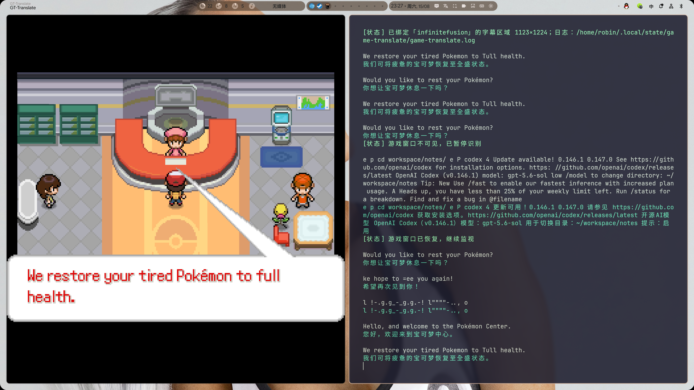

# game-translate

一个面向 Hyprland 的实时游戏字幕翻译工具。它直接跟踪游戏窗口，在画面稳定后执行 OCR，并通过本地 Ollama 模型把英文对白翻译成简体中文。

项目目前优先支持通过 Proton 运行的《Pokémon Infinite Fusion》。核心程序使用 Rust 编写，截图和翻译均在本机完成，不上传游戏画面。

> A fast, local-first English-to-Chinese game dialogue translator for Hyprland, written in Rust.



## 特性

- **跟踪游戏窗口**：选择一次程序窗口，之后窗口移动、缩放或切换布局时自动更新捕获区域。
- **不会误译其他程序**：绑定 Hyprland 窗口地址；目标不在活动工作区、滚出显示器视口或被隐藏时立即暂停。
- **为游戏对白优化的 OCR**：忽略画面中央的动画区域，分别分析顶部气泡和底部对话框。
- **像素字体多尺度识别**：低置信度文本会用 2× 最近邻缩放再次识别，改善低分辨率像素字体。
- **OCR 安全门**：过滤超长、高密度多行和 URL 内容，明显非游戏对白不会进入翻译或缓存。
- **等待文字完整显示**：连续三帧稳定后只执行一次 OCR，使用画面稳定性代替第二次 OCR 确认。
- **单色文字提取**：窗口模式收窄到上下对话区域，并通过最大颜色通道、Otsu 阈值和二值化保留白色与彩色高亮文字。
- **本地翻译**：通过 Ollama 运行 `qwen3:4b-instruct`，游戏画面和对白不会发送到云端。
- **宝可梦术语**：常见战斗模板使用固定术语，其余文本由模型结合术语提示翻译。
- **两级缓存**：256 条内存缓存加不限于内存容量的 SSD 文件缓存，重复对白可立即返回。
- **持续捕获不泄漏**：项目内置修正后的 `libwayshot`，显式释放每一帧 Wayland 捕获对象。

## 工作流程

```text
游戏窗口
   ↓ Hyprland IPC 跟踪位置
Wayland 内存截图
   ↓ 稳定帧检测
顶部/底部 HUD OCR
   ↓ 单色提取、置信度与按需候选
去重与宝可梦术语模板
   ↓
内存缓存 → 文件缓存 → 本地 Ollama
   ↓
终端实时显示原文和译文
```

截图不会写入磁盘。只有运行日志和翻译缓存保存在 `~/.local/state/game-translate/`。

## 系统要求

- Hyprland，并支持 wlroots screencopy 协议
- Rust 1.85+
- `slurp`
- Tesseract 及英文语言数据
- Ollama 与 `qwen3:4b-instruct`
- `kitty`、`jq`、`hyprctl`（启动脚本需要）

Arch Linux 可先安装基础依赖：

```sh
sudo pacman -S --needed rust slurp tesseract tesseract-data-eng kitty jq ollama
ollama pull qwen3:4b-instruct
```

如果发行版提供 systemd 服务，确保 Ollama 已经运行：

```sh
sudo systemctl enable --now ollama
```

不同发行版的 Ollama 服务名称可能不同，也可以直接运行 `ollama serve`。

## 构建与安装

```sh
git clone https://github.com/675076143/game-translate.git
cd game-translate
cargo build --release
install -Dm755 target/release/game-translate ~/.local/bin/game-translate
install -Dm755 game-translate-toggle ~/.local/bin/game-translate-toggle
```

启动脚本会打开一个标题为 `GT-Translate` 的 kitty 窗口；再次执行同一命令会关闭它。

## 使用方式

### 推荐：跟踪整个游戏窗口

```sh
game-translate-toggle --window
```

启动后点击一次游戏窗口。程序会：

1. 绑定所选 Hyprland 窗口；
2. 自动跟随其位置和当前尺寸；
3. 在窗口离开活动工作区、滚出显示器视口或被隐藏时暂停；
4. 窗口恢复可见后继续识别。

这是日常使用的推荐方式，也能避免相同屏幕坐标后来被其他程序占用时发生误翻译。

### 手动框选字幕区域

```sh
game-translate-toggle
# 等价于：game-translate-toggle --region
```

只框选对白文字，不要包含对话框边框。该区域仍会绑定到其所在窗口并随窗口移动。

## 平铺窗口建议

`GT-Translate` 是普通平铺窗口。为了不压缩游戏画面，建议先聚焦希望放置翻译输出的列，再启动工具。例如将游戏保持在左侧全高，让翻译窗口与终端在右侧上下平铺。

启动脚本使用独立 Wayland class `GT-Translate`，可以在自己的 Hyprland 配置中为它设置布局规则，但项目不会强制浮动或改动用户布局。

## 数据、缓存与日志

| 路径 | 用途 |
| --- | --- |
| `~/.local/state/game-translate/game-translate.log` | OCR、翻译来源和耗时诊断 |
| `~/.local/state/game-translate/translations.jsonl` | 跨重启翻译缓存 |

日志超过 1 MiB 后会在下次启动时清空。翻译缓存是追加写入的 JSON Lines 文件，适合 SSD；删除它即可清空历史翻译。

本地模型使用 2048 token 上下文，足够容纳术语提示和游戏对白，同时避免为无用的长上下文占用 KV cache 显存。

运行性能摘要：

```sh
cargo run --release --example perf_summary -- \
  ~/.local/state/game-translate/game-translate.log
```

## 常见问题

### 启动后没有输出

- `--window` 模式需要点击一次游戏窗口。
- 检查 Ollama：`ollama list` 中应存在 `qwen3:4b-instruct`。
- 查看日志：`tail -f ~/.local/state/game-translate/game-translate.log`。
- 如果日志显示“游戏窗口不可见”，切回游戏所在工作区。

### OCR 有少量错字

像素字体、打字机动画和半透明对话框都会影响 Tesseract。程序会等待三帧稳定，窗口模式还会提取单色文字；翻译提示会纠正常见 OCR 错字，但不会保证每个英文字符都完全正确。

### 翻译窗口压缩了游戏

这是平铺布局的正常行为。关闭翻译窗口，先聚焦另一列中的窗口，再重新启动，让 `GT-Translate` 插入目标列。

### 如何停止

再次运行相同启动命令，或直接关闭 `GT-Translate` 窗口。

## 开发与验证

```sh
cargo test
cargo clippy --all-targets -- -D warnings
```

OCR 回归测试会调用系统中的 Tesseract。

连续捕获压力测试：

```sh
cargo run --release --example capture_probe -- '0,0 1280x720' 1000
```

测试结束后，Hyprland 的 `RssShmem` 应回到开始前的水平。

## 当前范围

当前版本有意保持单一实现：一个 Wayland 捕获后端、一个 OCR 引擎、一个英译中方向和一个终端输出界面。暂不支持 X11、Windows、macOS、云端翻译服务或图形化设置界面。

设计与排障过程见：[从游戏画面到中文字幕：用 Rust 构建本地实时 OCR 翻译器](docs/blog/building-a-local-game-translator.md)。

## License

[MIT](LICENSE)
